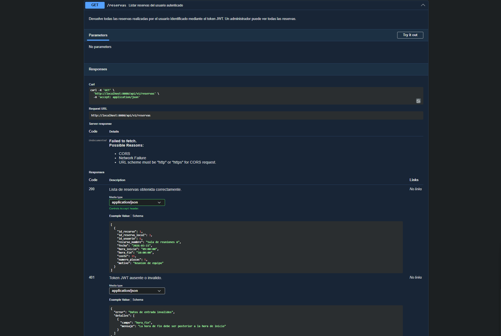

# Análisis de Dominio - API REST Sistema de Reservas

## 1. Tablas de la BBDD que participan en el CRUD de reservas

### Tabla principal: `reserva`

Esta es la entidad central que gestiona la API. Almacena las reservas que realizan los usuarios normales sobre recursos disponibles (salas, instalaciones deportivas, etc.).

| Campo             | Tipo SQL      | Tipo API      | ¿En API?          | Razón                                          |
|-------------------|---------------|---------------|-------------------|------------------------------------------------|
| `id_recurso`      | INT (PK, FK)  | integer       | Sí                | Identifica qué recurso se reserva              |
| `id_reserva_local`| INT (PK)      | integer       | Solo en respuesta | Lo genera el backend al insertar               |
| `id_usuario`      | INT (FK)      | —             | No                | El backend lo extrae del token JWT             |
| `fecha`           | DATE          | string (date) | Sí                | Fecha de la reserva                            |
| `hora_inicio`     | TIME          | string        | Sí                | Hora de inicio de la franja                    |
| `hora_fin`        | TIME          | string        | Sí                | Hora de fin de la franja                       |
| `coste`           | DECIMAL(10,2) | number        | Solo en respuesta | El backend lo calcula según recurso y duración |
| `numero_plazas`   | INT           | integer       | Sí                | Plazas que necesita el usuario                 |
| `motivo`          | TEXT          | string        | Sí                | Descripción opcional (máx. 20 caracteres)      |

### Tablas relacionadas

- **`recurso`**: Se necesita para mostrar el nombre del recurso en los listados. Se incluye `recurso_nombre` en las respuestas mediante un JOIN, evitando que el frontend necesite hacer peticiones adicionales para obtener ese dato.
- **`usuarionormal`**: El `id_usuario` de la reserva apunta a esta tabla. El usuario autenticado se identifica mediante el token JWT incluido en la cabecera `Authorization` de cada petición.
- **`horario` / `disponibleen`**: Definen las franjas horarias disponibles para cada recurso. El backend consulta estas tablas para validar que la franja horaria solicitada es válida, pero no forman parte del CRUD de reservas en sí.

## 2. Clave primaria compuesta

La tabla `reserva` no usa un único campo `id` para identificar cada fila, sino una **clave primaria compuesta** formada por dos campos: `id_recurso` e `id_reserva_local`. El campo `id_reserva_local` no es único globalmente sino que se reinicia por cada recurso. Por ejemplo:

| id_recurso | id_reserva_local | Descripción                    |
|------------|------------------|--------------------------------|
| 1          | 1                | Primera reserva del recurso 1  |
| 1          | 2                | Segunda reserva del recurso 1  |
| 2          | 1                | Primera reserva del recurso 2  |

Las filas con `id_recurso=1, id_reserva_local=2` y `id_recurso=2, id_reserva_local=1` son reservas distintas. Para identificar una reserva de forma única siempre hacen falta los dos valores.

Esto se refleja en las URLs de la API, que necesitan ambos parámetros en lugar del habitual `/{id}`:

```
GET    /api/v1/reservas/{id_recurso}/{id_reserva_local}
PATCH  /api/v1/reservas/{id_recurso}/{id_reserva_local}
DELETE /api/v1/reservas/{id_recurso}/{id_reserva_local}
```

## 3. Campos que genera el backend (no los envía el cliente)

- `id_reserva_local`: generado automáticamente al insertar en la BBDD.
- `id_usuario`: extraído del token JWT del usuario autenticado.
- `coste`: calculado por el backend en función del recurso y la duración de la reserva.
- `recurso_nombre`: obtenido del JOIN con la tabla `recurso`.

## 4. Validaciones y reglas de negocio

### Campos obligatorios (al crear una reserva)
- `id_recurso`, `fecha`, `hora_inicio`, `hora_fin`

### Restricciones de valores
- `id_recurso` debe corresponder a un recurso existente en la BBDD.
- `fecha` debe ser una fecha futura (no anterior a hoy).
- `hora_fin` debe ser posterior a `hora_inicio`.
- `numero_plazas` debe ser >= 1 si se especifica, y no puede superar la `capacidad` del recurso.
- `motivo` tiene un máximo de 20 caracteres.
- La franja horaria solicitada no debe solaparse con otra reserva existente sobre el mismo recurso.
- La franja debe coincidir con un horario disponible del recurso (tabla `disponibleen`).

### Autorización
- Solo usuarios de tipo `Normal` pueden crear reservas.
- Un usuario solo puede ver, modificar y eliminar sus propias reservas.
- Un usuario de tipo `Administrador` puede gestionar todas las reservas.


## 5. Ejemplos de JSON

**REQUEST** (crear reserva):

La petición que el cliente enviaría para crear una reserva podría ser:

```json
{
  "id_recurso": 1,
  "fecha": "2026-03-15",
  "hora_inicio": "09:00:00",
  "hora_fin": "10:00:00",
  "numero_plazas": 5,
  "motivo": "Reunion de equipo"
}

```

**RESPONSE** (reserva creada):

La respuesta que el backend devolvería al crear la reserva incluiría los campos generados automáticamente y el nombre de la sala:

```json
{
  "id_recurso": 1,
  "id_reserva_local": 3,
  "id_usuario": 6,
  "recurso_nombre": "Sala de reuniones A",
  "fecha": "2026-03-15",
  "hora_inicio": "09:00:00",
  "hora_fin": "10:00:00",
  "coste": 15.00,
  "numero_plazas": 5,
  "motivo": "Reunion de equipo"
}
```

**Errores comunes por parte del usuario:**

**REQUEST** (crear reserva):

Una peticion enviada con hora de fin anterior a la hora de inicio:

```json
{
  "id_recurso": 1,
  "fecha": "2026-03-15",
  "hora_inicio": "09:00:00",
  "hora_fin": "08:00:00",
  "numero_plazas": 5,
  "motivo": "Reunion de equipo"
}

```
**RESPONSE** (error 400):
```json
{
    "campo": "hora_fin",
    "mensaje": "La hora de fin debe ser posterior a la hora de inicio"
}

```

**REQUEST** (crear reserva):

Una peticion enviada con numero de plazas mayor a la capacidad:

```json
{
  "id_recurso": 1,
  "fecha": "2026-03-15",
  "hora_inicio": "09:00:00",
  "hora_fin": "10:00:00",
  "numero_plazas": 20,
  "motivo": "Reunion de equipo"
}

```
**RESPONSE** (error 400):
```json
{
    "campo": "numero_plazas",
    "mensaje": "El numero de plazas supera la capacidad del recurso"
}
```

## Validación Swagger UI

La siguiente captura muestra la especificación OpenAPI cargada correctamente en Swagger UI, con los endpoints y ejemplos de respuesta visibles:



## Conclusión

La tabla `reserva` tiene 9 campos, de los cuales 7 se envían o reciben directamente en la API
(los 2 restantes los gestiona el backend: `id_usuario` desde el token y `coste` calculado).
Con 6 validaciones cubrimos los casos de error más habituales y garantizamos la integridad de los datos.
El resultado es una API sencilla que cubre el ciclo completo: crear, consultar, modificar y cancelar reservas.
